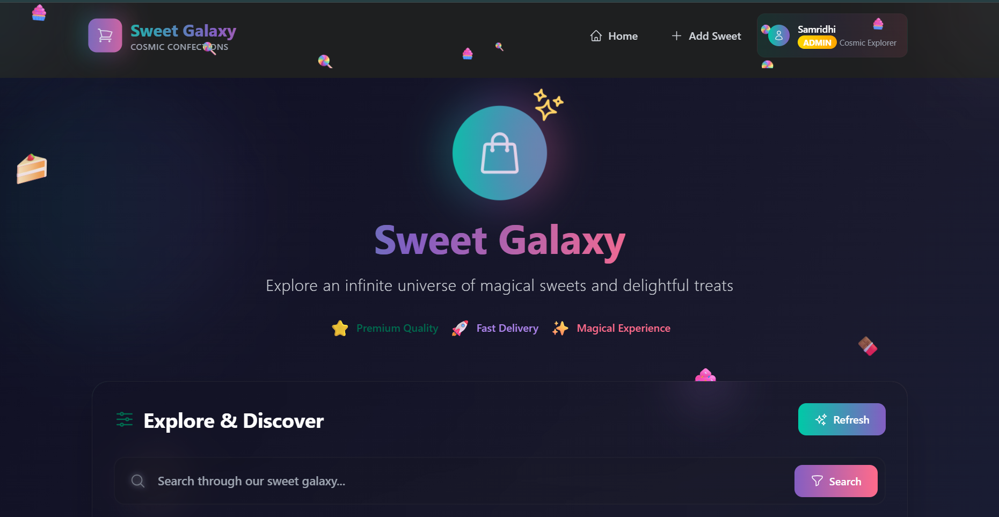
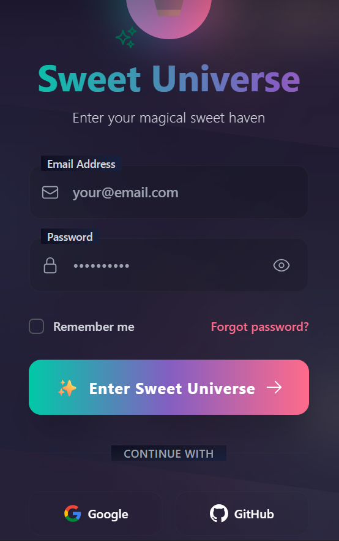
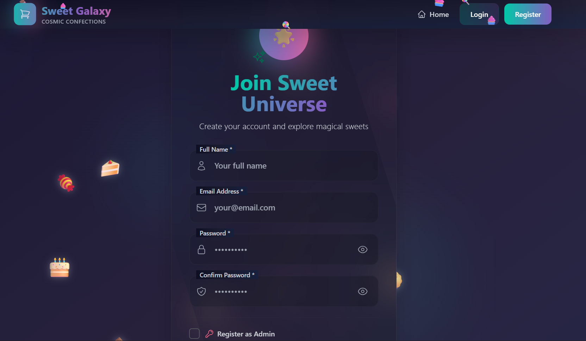
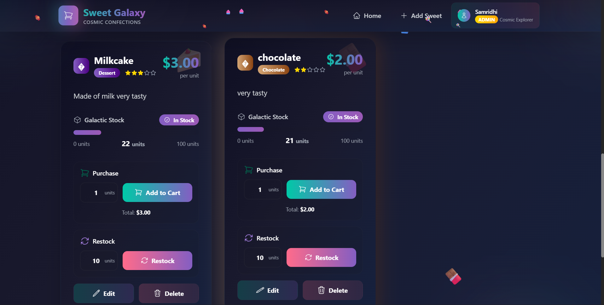
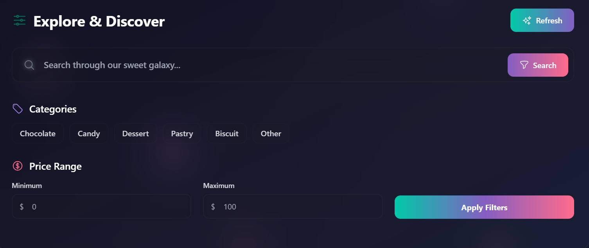

🍭 Sweet Galaxy - Cosmic Sweet Shop Management System

## 📸 Screenshots

### **Home Page**

### **Login View**

### **Register View**

### **SweetCard View**

### **AddSweet View**

🌟 Project Overview
Sweet Galaxy is a full-stack cosmic-themed sweet shop management system that transports users to a celestial candy universe. This application allows shop owners and customers to browse, purchase, and manage a stellar collection of sweets with an immersive nebula-inspired interface.

✨ Key Features
🚀 Cosmic UI/UX: Stunning nebula gradients, floating animations, and glass-morphism effects

🛒 Sweet Management: Complete CRUD operations for sweets (Create, Read, Update, Delete)

👑 Admin Controls: Secure admin panel for inventory management and user oversight

🔍 Advanced Filtering: Search by name, category, and price range with real-time results

🛍️ Purchase System: Real-time inventory tracking and seamless purchasing experience

🔐 Authentication: Secure user registration and login with JWT protection

📱 Responsive Design: Fully mobile-friendly interface across all devices

🎨 Modern Design: Tailwind CSS with custom animations and transitions

📊 Dashboard Analytics: Visual insights into sales and inventory performance

🏗️ Tech Stack
  React.js 18 - Component-based UI library

  Tailwind CSS - Utility-first CSS framework

  React Router DOM v6 - Client-side routing

  Heroicons - Beautiful hand-crafted SVG icons

  React Hot Toast - Elegant notifications

  Axios - HTTP client for API requests

  React Hook Form - Form handling and validation

  Backend:
  Node.js & Express.js - Server runtime and framework

  MongoDB with Mongoose - NoSQL database and ODM

  JWT Authentication - Secure token-based authentication

  Bcrypt.js - Password hashing and security

  CORS - Cross-origin resource sharing

  Dotenv - Environment configuration

🚀 Quick Start
  Prerequisites
  Node.js (v16 or higher) - Download

  MongoDB (v4.4 or higher) - Download

  npm or yarn package manager

  Git for version control

Installation
1. Clone the Repository
  # Clone the project
  git clone https://github.com/Rudra-Kapoor/Sweet_Galaxy.git

  # Navigate to project directory
  cd SWEET_SHOP

2. Backend Setup
  # Navigate to backend directory
  cd backend

  # Install dependencies
  npm install

  # Create environment file
  cp .env.example .env

  # Edit .env file with your configurations

  # Add your MongoDB URI and JWT secret

3. Frontend Setup
  # Navigate to frontend directory (from root)
  cd frontend

  # Install dependencies
  npm install

🤖 My AI Usage
📋 AI Assistance Disclosure
This project was developed with assistance from AI tools to enhance productivity and code quality. All AI-generated content was reviewed, modified, and validated through human oversight.

🛠️ How AI Was Used
1. Code Development
Backend Structure: Generated Express.js server setup, middleware, and route handlers

Frontend Components: Created React components with Tailwind CSS styling

Database Models: Assisted in designing MongoDB schemas with validation

API Endpoints: Helped structure RESTful API with proper error handling

2. Problem Solving
Debugging: Identified and fixed Node.js, React, and MongoDB errors

Optimization: Suggested performance improvements for database queries

Security: Recommended JWT authentication and input validation practices

3. Documentation
README Creation: Assisted in structuring comprehensive documentation

Code Comments: Generated meaningful explanations for complex functions

Installation Guide: Created step-by-step setup instructions

4. Design & UX
CSS/UI Suggestions: Provided Tailwind CSS combinations for visual effects

Layout Ideas: Suggested responsive design patterns

Animation Guidance: Recommended CSS animations for cosmic theme

🛠️ AI Tools Used
ChatGPT/DeepSeek: For code suggestions and problem-solving

GitHub Copilot: For inline code completion

VS Code AI Extensions: For real-time development assistance
